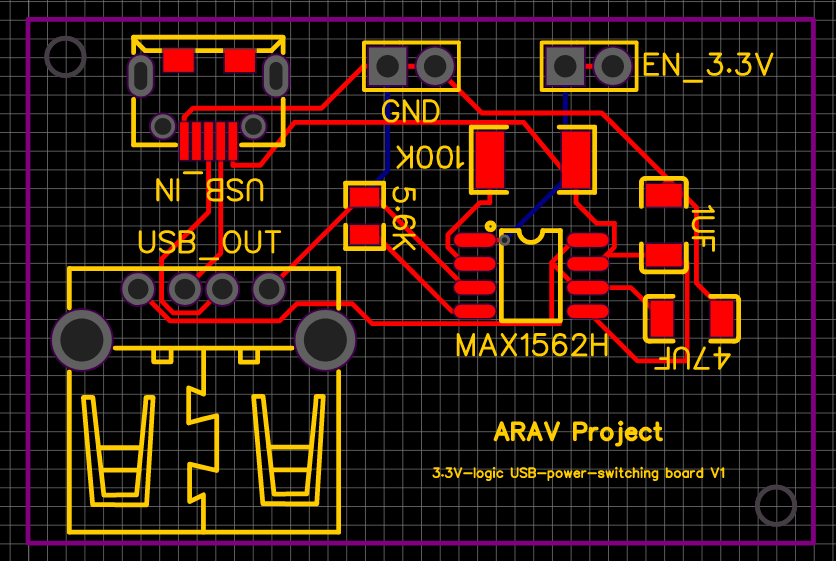

# Expansion PCB layout V1

## Expansion PCB schematic V1

<a href="Expansion_PCB_BOM_V1.csv">Expansion PCB BOM V1</a> 

# Expansion PCB layout V2

## Expansion PCB schematic V2

# Power switch PCB layout

## Power switch PCB schematic

<a href="power_switch_PCB_BOM.csv">power switch PCB BOM</a> 

# Power Bank PCB layout

## Power Bank PCB schematic

<a href="Power_Bank_BOM.csv">Power Bank BOM</a> 

