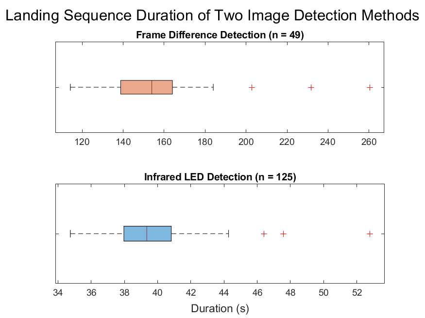

## FT.1.1.1 - UAV Command Responsiveness: Confirm reliability of wireless communication between Landing Platform and UAV. (MR-1, ER-1)

Setup: The UAV established a wireless connection to the charging platform’s Single Board Computer (SBC) via CrazyRadio PA module. The SBC ran a Python script that queried the battery voltage on the UAV. The script in question logged the timestamps of both the outgoing query and incoming UAV response. This script was run at increasing distances between the SBC and the UAV.

Expected Outcome: The UAV will successfully respond to commands sent by the Single Board Computer at least 95% of the time, up to a distance of 3 m.

Actual Results: At distances ranging from 0 to 3.2 meters, 100% responsiveness was observed for UAV communications (n = 3,767).

Conclusion: Wireless communication between the charging platform’s SBC and the UAV is sufficiently reliable to respond as desired for basic control commands.  

## FT.2.2.1 - Software Landing of UAV: Perform controlled landings of the aerial vehicle by means of software-automated flight control commands in order to ensure adequate precision of landings upon a target set point. (MR-2, ER-2).

Setup: The charging platform’s SBC was equipped with the Crazyradio PA module and the developed Python script capable of performing autonomous control of the UAV. The SBC was connected to the OpenMV camera module, which ran an image detection method  in order to generate the UAV positional information as needed for the SBC to determine flight commands. The UAV was instructed to lift off from a ground location that was approximately 1 m from the OpenMV camera and ascend to a height of 2 m, such that it would enter the vision cone of the camera. The UAV position could then be interpreted from the image detection method, and the SBC attempted to autonomously land the UAV on a target ground point. Both frame differencing and infrared LED beacon image recognition schemes were tested, and all autonomous landings were performed in an indoor environment over a smooth, patterned surface.

Expected Outcome: Attempts are expected to achieve successful landings to within 5 cm of target, thus demonstrating that software landing can achieve ideal placement upon a wireless charging pad.

Actual Results: With Frame Differencing, precision of 3.6 ± 0.4 cm (95% C.I., n = 99). With IR LED, precision of 3.4 ± 0.3 cm (95% C.I., n = 125)

Conclusion: Software landings made with machine vision detection methods are well within our target accuracy specifications for both Frame Differencing and IR LED image detection methods.

## FT.2.3.1 - UAV Command Latency:  Determine total command latency from the issuance of a single query command by the Single Board Computer (SBC) to a corresponding response by the UAV control board. (MR-2, ER-3).

Setup: The UAV established a wireless connection to the charging platform’s Single Board Computer (SBC) via CrazyRadio PA module. The SBC ran a Python script that queried the battery voltage on the UAV. The script in question logged the timestamps of both the outgoing query and incoming UAV response. This script was run at increasing distances between the SBC and the UAV.

Expected Outcome:  The latency between the battery voltage query and the UAV response will be less than 100 ms for adequate control timing. [9]

Actual Results: Latency was approximately 10 ms at each distance (n ≥ 450 for all), with an average of 9.99 ± 0.36 ms at 3.2 meters (n = 467).

Conclusion: Wireless communication between the charging platform’s SBC and the UAV is rapid enough to respond as desired for basic control commands.

## FT.3.4.1 - UAV Charge Time: Determine the total time required to charge the UAV battery using the Qi wireless charging pad. (MR-3, ER-4).

Setup: A series of tests were planned to perform timed trials of UAV wireless recharging for both of the available LiPo battery configurations (250 mAh and 380 mAh).  The UAV would perform flight operations until its battery was depleted to the point of being unable to maintain flight. The UAV would then be recharged until it reported a full battery status to the charging platform’s SBC. As of April, undetermined hardware failures have prevented the completion of these trials Repeated attempts to charge the UAV both wirelessly via Qi charging pad and directly via USB power supply have yielded either zero retained charge or electrolyte decomposition (as exhibited by LiPo battery swelling). Prior to our decision to refrain from further recharge attempts until access to spare batteries and/or alternative Qi charging pad options were available, two test results were documented - one completed recharge with the 250 mAh UAV battery via Qi wireless charging pad (albeit prior to the custom PCB implementation), and one complete recharge with the 250 mAh battery via direct USB-connected power supply (and including the custom PCB).  

Expected Outcome: The UAV battery will be fully charged within 1 hour.

Actual Results: An initial wireless recharging trial with the 250 mAh battery but without the custom PCB was completed in 75 minutes. A direct USB recharge of the UAV with the 250 mAh battery and custom PCB took 2 hours and 17 minutes. All other trial attempts resulted in battery failure.

Conclusion: Neither of the recorded trials is a direct analog to the final system implementation, and iterative testing could not be completed at this time without severe risk of losing functionality of our remaining LiPo batteries. Due to recent shelter-in-place orders which preclude access to electrical laboratory equipment, further troubleshooting of hardware failures could not be adequately performed at team members’ residential work spaces.As we are not able to diagnose and resolve the UAV recharging problems at this time,  we must defer the determination of the specified UAV wireless recharge time to future works.

## FT.4.5.1 - Camera Power Consumption: Test the power consumed by the camera when our chosen image detection method is running. (MR-4, ER-5)
Setup: The camera module ran a specific image detection method. The power consumption over a 25 minute period was determined via USB power monitor. The test was performed once while a detectable object was the frame and once without any detectable object in frame.

Expected Outcome: The Camera module will consume no more than 5 W, regardless of whether or not a detectable object is in frame.

Actual Results: The mean power consumption for the camera was 734 ± 5 mW (95% C.I., n = 1,617) during idle state, and 776 ± 0.3 mW (95% C.I., n = 1,874) during active detection.

Conclusion: The camera module meets the specified power requirements.

## FT.4.5.2 - Qi Charger Power Consumption: Test power consumption of Qi charger while actively recharging UAV battery. (MR-4, ER-5)
Setup: A USB power consumption monitor was placed inline with the transmitting Qi charger while the operating UAV battery (OEM 250 mAh LiPo) was charging. The power consumption measurements, sampled every second, were averaged over the recorded test period.

Expected Outcome: Qi charger should consume no more than 10 W.

Actual Results: Average power draw of 1.823 W over a 75 minute charging period.

Conclusion: The Qi charger meets the specified power requirements.

## FT.4.5.3 - Single Board Computer Power Consumption: Test power consumption of single board computer in charging platform. (MR-4, ER-5)

Setup: A USB power consumption monitor was placed inline with the single board computer (SBC) and a suitable power supply. The SBC was allowed to idle for 25 minutes while idle-state power consumption measurements were taken. The SBC power consumption was then measured while running a fourth-thread stress test program which utilized > 75% CPU capacity for 25 minutes. For both test iterations, the power consumption measurements, sampled every second, were averaged over the recorded test period.

Expected Outcome: Single board computer will consume no more than 15 W during either test iteration.

Actual Results: The mean power consumption for the SBC was 2.197 ± 0.005 W (95% C.I., n = 1,459) during idle state, and 2.843 ± 0.004 W (95% C.I., n = 1,721) during stress test.

Conclusion: The single board computer meets the specified power requirements.

## ST.4.5.1 -  System Battery Life: Confirm that the charging platform’s battery supports system operation at 25 W over the specified time period of 4 hours. (MR-4, ER-5)

Setup: An initial test was planned which involved powering all charging platform components at maximum usage by the fully-charged 5 V battery pack, as specified by the system design. The system’s total operation time until failure of at least one component would be measured. However, due to considerations for our project budget, should the $50 battery pack become damaged during a stress test, we deemed that reliance on manufacturer specifications for both energy storage and current limits to be reasonably accurate.

Expected Outcome: The combined power consumption of all core subsystem components shall not exceed 25 W and the battery pack shall be capable of providing at least this amount and maintain operation for at least 4 hours. (See Functional Tests 4.5.1 through 4.5.3 above for rough breakdown of component power limits). The expected endurance of the system will be projected from these manufacturer specifications.

Actual Results: The component power consumption tests described above suggested a maximum total system power requirement of approximately 5.442 W, which was far less than our early, rough estimates. The 5V battery pack selected for the charging platform (RAVPower 26,800 mAh Power Bank) is specified by its manufacturer to provide a maximum of 27.5 W. At 5V, the 26,800 mAh capacity of the battery pack yields 134 Watt-hours, which would offer 4.87 hours of operation at its maximum power, 27.5 W.  At the system power requirements as tested (5.442 W), our charging platform may be expected to operate at maximum capacity for 24.6 hours. This estimate does not take into account any potential power savings from configuring the SBC software to turn off the OpenMV camera and/or Qi charging pad when not in use, which would be possible with the custom power switching PCBs designed as potential accessories to our charging platform. Nonetheless, our projected (and to-date, unverified) system power specifications are roughly 5.5 W operating power, up to 24 hours of continuous operation on the selected 5V battery pack.

Conclusion: The 5V battery pack provided more than our expected needs and far more than the actual power requirements of the subsystem. A verification of any projected specifications has not been performed at this time, but the system can be reasonably expected to operate for at least 4 hours, and likely 2 or 3 times this duration.

## FT.5.6.1 - UAV Hover Endurance: Determine the total amount of time the UAV is able to hover for the two available battery capacities (250 mAh and 380 mAh). (MR-5, ER-6)

Setup: Begin timing UAV once it lifts off and commences a software-defined hover routine at a fixed height from the ground. Continue timing until the UAV is unable to maintain the hover height.

Expected Outcome: UAV hovers for at least 5 minutes with each battery.

Actual Results:  Initially,  the stock Crazyflie UAV was able to hover for 6 minutes with a 250 mAh battery and 8 minutes with a 380 mAh battery. On subsequent re-test with the additional hardware payload (custom PCB and performance motors), the UAV was able to hover for 3.52 minutes on average with the 250 mAh battery.

Conclusion: Initial tests of the Crazyflie 2.1 hardware met expectations, however later tests did not, due to late-stage hardware changes. As a result of the additional weight and power consumption from the performance motors and IR LED circuit, the UAV flight time was reduced by over one half as a result of these changes. To meet our previously-stated goals, the additional hardware would need to be removed. As this is not possible without compromising the key functionalities of our system, our flight duration specification will have to be adjusted to reflect the current implementation.

## FT.5.6.2 -  UAV Mobility Endurance: Determine the total amount of time the UAV is able to fly a given autonomous flight pattern. This pattern could either be in the horizontal or vertical planes. (MR-5, ER-6)

Setup: Two autonomous flight routines will be performed by a UAV equipped with a fully-charged onboard battery. The first routine will be a horizontal figure-eight pattern and the second will be a vertical figure-eight pattern. The UAV will be timed from initial take-off until flight failure due to inadequate battery power. The tests were performed with 250 mAh batteries.

Expected Outcome: UAV will be able to maintain either autonomous flight routine for at least five minutes.

Actual Results: Initially, the stock Crazyflie UAV was able to perform the autonomous flight maneuver for 6 minutes with a 250 mAh battery and 7 minutes with a 380 mAh battery. On subsequent re-test with the additional hardware payload (custom PCB and performance motors), the UAV was able to perform the maneuver 2.33 minutes on average with the 250 mAh battery.

Conclusion: Initial tests of the Crazyflie 2.1 hardware met expectations, however later tests did not, due to late-stage hardware changes. As a result of the additional weight and power consumption from the performance motors and IR LED circuit, the UAV flight time was reduced by over one half as a result of these changes. To meet our previously-stated goals, the additional hardware would need to be removed. As this is not possible without compromising the key functionalities of our system, our flight duration specification will have to be adjusted to reflect the current implementation.

## Landing Routine Duration: Determine the total amount of time required to autonomously land the UAV. (MR-5, ER-6)

Setup:  An in-flight UAV was positioned at the edge of the charging platform’s detectable range, at a height of 2.3 m and approximately 0.76 meters from the camera as projected onto the landing space. The UAV angle was known for the entire duration. The completion of the autonomous landing sequence was timed in software, and only successful landings were considered to be valid data points.

Expected Outcome: The time trials should indicate that successful landings can be made within two minutes for all specified image detection schemes.

Actual Results: Use of the Frame Differencing image detection method resulted in an autonomous landing sequence completion time of 156. 411 ± 7.422 seconds (95% C.I., n = 49). Use of the IR LED detection method resulted in an autonomous landing sequence completion time of  39.567 ± 0.445 seconds (95% C.I., n = 125)

Conclusion: The autonomous landing program was successful in completing landings of a UAV in its field of view within our target timeframe, and the IR LED image detection method was far more capable at quickly providing accurate UAV positioning information to the SBC when compared to Frame Differencing.

## FT.6.7.1 - Image Detection Method Range: Determine the range of reliable UAV detection by various image detection methods. (MR-6, MR-7, ER-7)

Setup: The camera module was configured for a desired image-recognition mode. The UAV was manually brought into frame and raised to various height intervals to determine the limits of reliably detecting the UAV with a given image detection method (RBG detection, April Tag, Frame Difference, and IR LED detection). This range determination was made for each of the various image-recognition modes by monitoring real-time detection success over a serial interface.

Expected Outcome: The camera module should consistently detect the UAV up to 2 meters in an indoor environment lit by T8 fluorescent light bulbs.

Actual Results: The camera module reliably detected the UAV up to 2.79 m, 1.52 m, 1.83 m, and 3.08 m for the RGB, April Tag, Frame Difference, and IR LED detection methods, respectively. The Frame Difference detection method was observed to be very sensitive to errors from background disturbances in frame, such as human passersby or a shimmer of reflected light.

Conclusion: IR LED beacons provided the most reliable detection within our test parameters, and faster frame rate than RGB detection. It was the most ideal choice for the scope of our system, and exceeded our target detection range specification of 2 meters.

## ST.8.8.1 -   Dimension Measurement: Confirm that the complete system is constrained to a size which supports portability. (MR-8, ER-8)

Setup: The charging platform’s physical dimensions will be measured with a ruler and its footprint will be determined.
Expected Outcome: As modeled and as assembled, the charging platform will have a footprint under 0.25 m2.

Actual Results: Charging platform enclosure was measured to have dimensions of 40 cm x 40 cm x 7.2 cm, resulting in a footprint of 0.16 m2.

Conclusion: The charging platform meets its modeled specifications for a portable size.

## FT.9.9.1 - Network Access Test: Confirm that charging platform’s single board computer can be accessed via SSH (MR-9, ER-9)

Setup: 100 SSH connections were made and the resulting connection success pass/fail variable was recorded to a log file.

Expected Outcome: The single board computer should be able to make a successful connection 95% of the time.

Actual Results: 100/100 SSH attempts connected to the remote shell successfully

Conclusion: Network access reliability is more than adequate for our system.

## FT.10.10.1 - Anchor Point Weight Test: Confirm that the UAV anchor points will support twice the weight of the UAV on an anchor line. (MR-10, ER-10)

Setup: A 5 lb fishing line will be affixed to the UAV anchor point, with its loose end secured to a weight equivalent to twice the weight of the UAV. The UAV will be securely mounted to a fixed structure while the anchor point’s durability is tested with the freely-hanging weight.

Expected Outcome: The anchor point will not fail, and support the specified weight without compromising its structural integrity.

Actual Results: The anchor point was able to hold the UAV along with an added NEMA 17 stepper motor for over six hours.

Conclusion: The anchor point exceeds weight specifications and will operate as expected.
